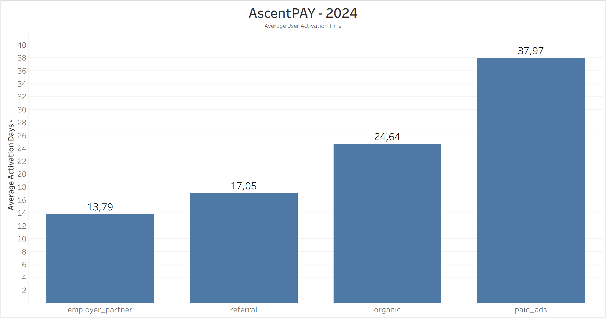
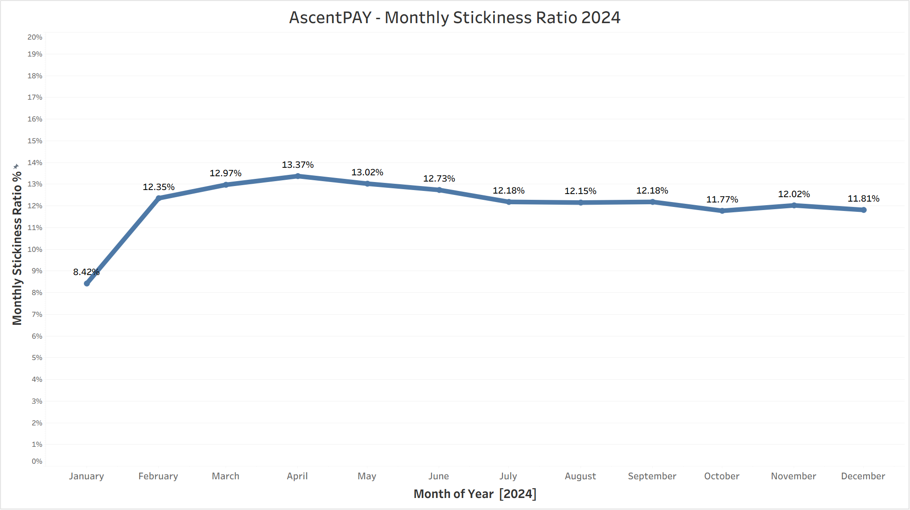
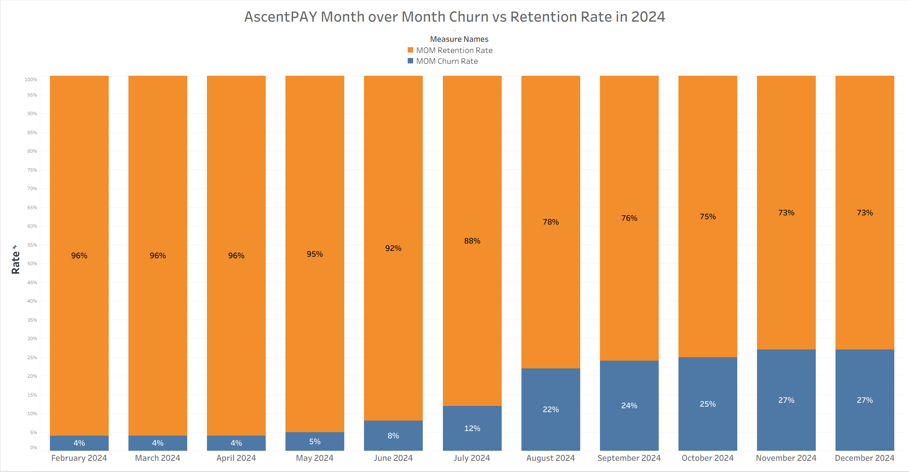
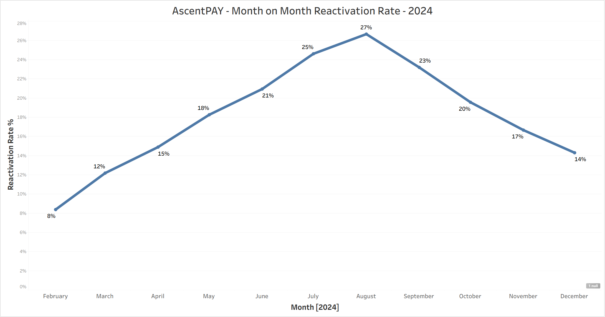
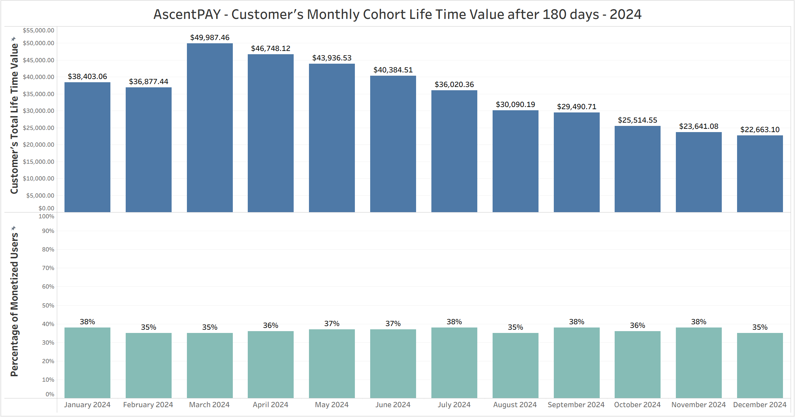
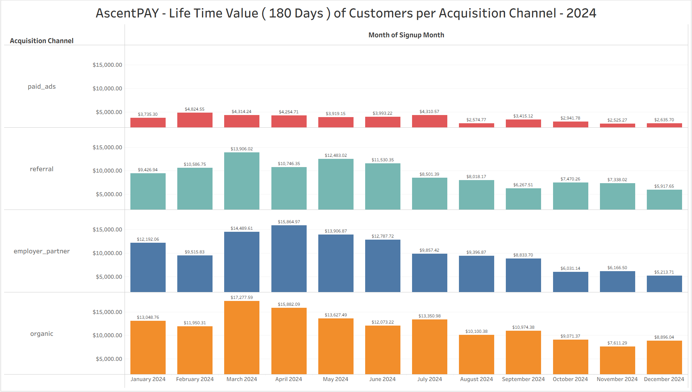
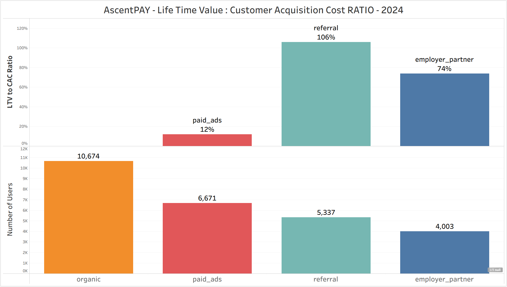
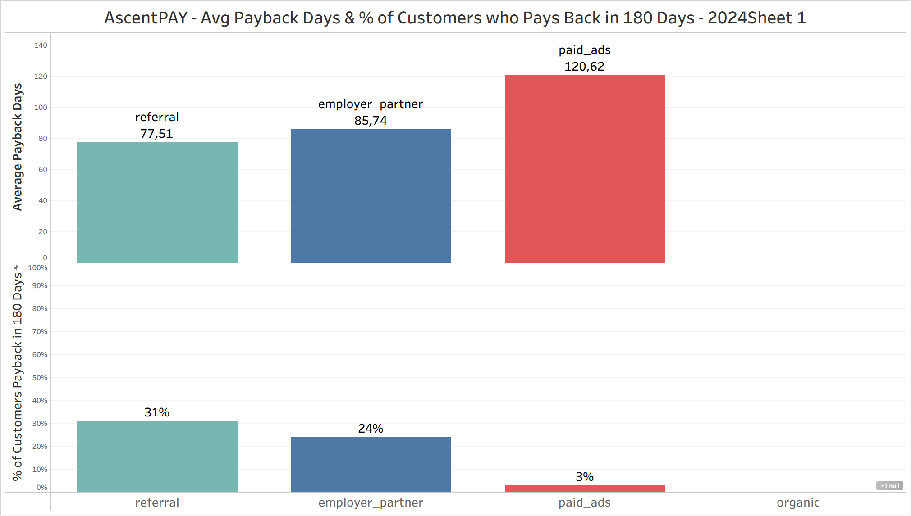
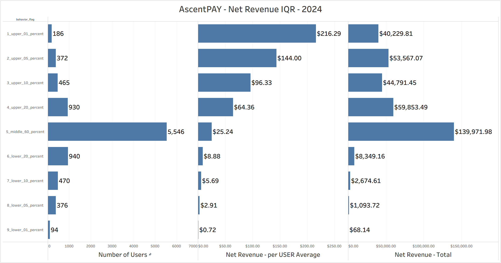
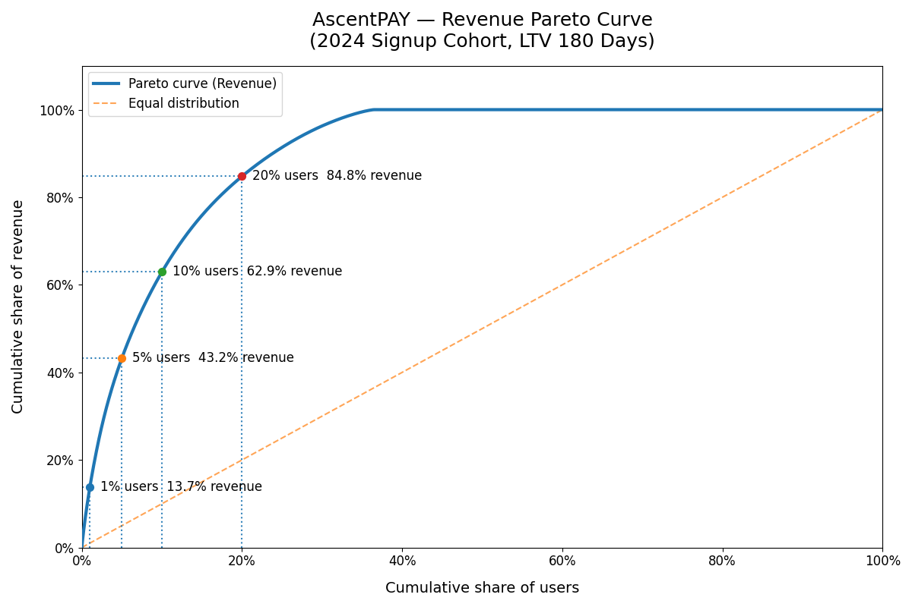

# FinTech “AscentPAY” Digital Wallet Product Analytics  
**Activation • Retention • LTV • Revenue Concentration**

This project analyzes synthetic but realistic digital wallet data from AscentPAY, a simulated FinTech product designed to resemble real-world payment apps that earn money from transaction fees.

The dataset includes tens of thousands of users, hundreds of thousands of transactions, and multiple supporting tables (users, transactions, events, and acquisition costs).

The analysis examines how users start using the product, whether they keep using it, how much revenue they generate over time, and how concentrated that revenue is. The goal is to assess overall product health and long-term revenue stability using clear, business-aligned metrics.

 

➤ **Project Goal / Purpose:**  
Understand whether AscentPAY’s revenue comes from broad, healthy usage across many users or from a small group of high-value users, and evaluate long-term sustainability through activation speed, retention, customer value (LTV), and acquisition cost payback.

 

➤ **Skills Demonstrated:**  
Product analytics and KPI design, activation and engagement analysis, retention and reactivation analysis, cohort-based LTV modeling, monetization and revenue analysis, CAC efficiency and payback analysis, revenue concentration and Pareto analysis
(SQL • Python • Pandas • FinTech metrics • executive-ready analysis)

 

➤ **Core Business Questions:**
- How long does it take users to complete their first revenue-generating transaction after signup?
- Do users keep transacting month after month, or do they drop off?
- When users churn, do they come back and continue using the product?
- Which users actually generate revenue, and how concentrated is that revenue?
- Do users generate enough lifetime value to justify their acquisition cost?
- How fragile is revenue if high-spending users stop using the product?

 

➤ **Executive Summary:**  

Across the full analysis, AscentPAY shows strong early activation but weakening retention over time. 
Revenue is highly concentrated among a small group of users, and paid acquisition performs poorly on early value and cost recovery.
Without improvements in retention and revenue stability, scaling user growth increases risk rather than long-term revenue.

  

# ➤ The Main Report : 
---

 

## Dataset :

The raw dataset spans 2024–mid-2026, but this project’s reporting and conclusions are intentionally scoped to calendar year 2024. 

The analysis uses four core tables representing a digital wallet product:

**users**
  - One row per user
  - Contains signup timestamp, acquisition channel, device type, KYC level, risk segment, and demographics
  - Used to define cohorts and user-level attributes

**transactions**
  - One row per transaction
  - Includes transaction timestamp, transaction type, gross amount, net revenue to the app, and refund indicators
  - Used for activation, retention, revenue, LTV, and concentration analysis

**events**
  - One row per product event (e.g., app opens)
  - Used to measure product engagement and usage frequency (e.g., stickiness)

**acquisition_costs**
  - One row per acquisition channel and date range
  - Contains customer acquisition cost (CAC) assumptions by channel
  - Used to evaluate LTV-to-CAC efficiency and payback periods

The raw dataset spans **2024 through mid-2026**.  
All reporting and conclusions in this project are intentionally scoped to **calendar year 2024** for consistency.

 
---
 

# Key Questions Answered

## 1 - Activation & Engagement

 

**1.1 - User Activation Speed**  
How long does it take users to complete their first transaction after signup, and does activation speed differ by acquisition channel?

  

**Method**
- Identify users who made at least one transaction after signup
- For each of those users, find the date of their first transaction
- Calculate the number of days between signup and first transaction
- Average this time by acquisition channel
- Restrict the analysis to users who signed up in 2024

**Key Insights**
- Users acquired through employer partnerships activate the fastest, reaching their first transaction in under two weeks on average.
- Referral users activate relatively quickly, suggesting trust and intent accelerate early usage.
- Organic users take meaningfully longer to activate, indicating weaker initial intent or higher onboarding friction.
- Paid acquisition users are the slowest to activate by a wide margin, taking more than a month on average to complete their first transaction.
- Slower activation delays revenue realization and increases early churn risk, especially for paid acquisition channels.

 

**1.2 - Product Engagement (Monthly Stickiness)**  
Once users are active, how consistently do they return and use the product over time?

  

**Method**
- Treat any transaction or in-app event as product activity
- Count daily active users (DAU) for each day
- Average daily active users within each month
- Count monthly active users (MAU) as distinct users per month
- Calculate monthly stickiness as average DAU divided by MAU
- Restrict the analysis to calendar year 2024

**Key Insights**
- Only a small share of monthly users use the product on a typical day.
- Stickiness increases early in the year, then levels off with a slight decline.
- Even at its peak, fewer than one in five monthly users are active daily.
- Daily usage remains limited relative to the overall monthly user base.

 

**1.3 - Business Implications**  

- Users make a first transaction, but most do not use the product often after that, so the business should focus on what users do after their first transaction.
- Users reach their first transaction quickly, but they do not come back many times, so the first transaction should be treated as the start, not the end.
- Making users activate faster does not make them use the product more often, so success should not be measured only by activation speed.
- Many users use the product only a few days in a month, so the product needs clearer reasons for users to come back more often.
- Improving activation speed alone will not change how often users use the product, so effort should be split between faster activation and more frequent use.

  

## 2 - Retention, Churn & Reactivation

**2.1 - Month-over-Month Retention & Churn (Revenue-Active Users)**  
What are the month-over-month retention and churn rates for revenue-active users?

  

#### Method
- Treat user activity as having at least one transaction in a month
- Identify users with transactions in each calendar month of 2024
- A user is retained if they transact in two consecutive months
- Calculate month-over-month retention as retained users divided by prior-month active users
- Calculate month-over-month churn as users active in the prior month who do not transact again in the current month

#### Key Insights
- Early in the year, most revenue-active users continue transacting month to month, but from mid-year onward more users stop transacting between consecutive months.
- By late 2024, about 1 out of every 4 revenue-active users stops transacting each month.
- Over time, the level of churn increases and more users stop transacting.

 

**2.2 - Reactivation of Lapsed Users**  
When Users stop transacting, how often do they return and generate revenue again?

  

#### Method
- Identify users with at least one transaction in each month of 2024
- Build a universe of users who transacted at least once during 2024
- Classify users as:
  - **Retained**: transacted in both the current and previous month
  - **Reactivated**: transacted in the current month but not in the previous
- Calculate reactivation rate as reactivated users divided by users who were inactive in the prior month
- Track reactivation patterns across the year

#### Key Insights
Reactivation rates increases through mid-year, peaking around 25–27%, then decline toward the end of 2024.

 

**2.3 - Business Implications**  
- More users stop transacting month to month as the year goes on, and reactivation does not increase enough to compensate, so the active user base naturally shrinks over time.
- Although some users return after being inactive, this behavior weakens later in the year, so reactivation cannot be relied on to offset rising churn.
- Because fewer users stay active and fewer return after dropping out, maintaining revenue increasingly depends on keeping existing users from leaving in the first place.
- Efforts should focus more on preventing users from stopping their activity than on trying to bring them back after they leave.

  

## 3 - Customer Value (LTV)

**3.1- 180-day LTV by Signup Cohort**  
How much net revenue do users generate in their first 180 days by signup cohort?

  

#### Method
- Restrict the analysis to users who signed up in 2024
- For each user, sum net revenue generated within the first 180 days after signup, treating refunds as negative revenue
- Ignore transactions that occurred before signup or after the 180-day window
- Aggregate total 180-day revenue by signup month
- Include all users, including those with zero revenue, to avoid survivorship bias
- Report total 180-day revenue per signup cohort and the share of users with LTV greater than zero

#### Key Insights
- Signup cohorts from earlier in 2024 generate more total revenue in their first 180 days than cohorts that joined later in the year.
- Total 180-day revenue declines for cohorts that sign up after mid-year.

 

**3.2- Early LTV by Acquisition Channel**  
Which signup sources produce users who generate the most value in their first 180 days?

  

#### Method
- Start from all users and their signup date and acquisition channel.
- Join transactions to users so users with no transactions are still included.
- Count transaction revenue only if it happens within 180 days after signup.
- Treat refunds as negative revenue.
- Sum 180-day revenue at the user level.
- Aggregate results by signup month and acquisition channel, reporting cohort size and total 180-day revenue.
- The report is filtered to show only 2024 signup cohorts in Tableau; the SQL itself is not restricted to 2024.

#### Key Insights
- Organic cohorts generate the highest total 180-day revenue in most months (it leads in 10 out of 12 signup months).
- Employer_partner is usually second, and is #1 only in May and June.
- Referral is consistently strong but generally below organic and employer_partner (often #3, and #2 in a few late-year months).
- Paid_ads is the lowest 180-day revenue channel every month.
- Across all channels, 180-day revenue is much higher in the first half of 2024 than in the second half (later signup cohorts generate less total 180-day revenue than early cohorts).

 

**3.3 - Business Implications**  
- Total 180-day revenue falls for later signup cohorts mainly because there are fewer users, so the business needs to understand and address the decline in cohort size before expecting revenue to grow.
- Employer partner and referral channels generate more revenue per user within 180 days, so these channels should be treated as high-efficiency sources and protected from quality dilution.
- Paid acquisition generates the lowest 180-day revenue, so spending on this channel should be limited unless early revenue improves.
- Organic acquisition contributes the most total 180-day revenue but weakens for later cohorts, so relying on organic growth alone will not sustain revenue if cohort size continues to shrink.
- Because some channels generate revenue through volume and others through higher value per user, the business must decide which model it wants to scale and manage acquisition channels differently instead of treating them the same.

  

## 4 - Monetization Mechanics

**4.1- Overall Revenue Stack (GMV, Net Revenue, Take Rate)**  
How much transaction volume flows through the product, how much revenue AscentPAY captures, and how efficiently it monetizes that volume?

  

#### Method
- Restrict transactions to monetizable spend types (card payments, bill pay, FX payments).
- Exclude refunds from all calculations.
- Exclude top-ups and peer-to-peer transfers from GMV.
- Aggregate monthly GMV and net revenue.
- Compute take rate as net revenue divided by GMV.
- Filter the final report to calendar year 2024 in Tableau (not in the SQL).

#### Key Insights
- Net revenue rises through July, then declines through year-end.
- Take rate stays tightly stable (~1.18%–1.30%) month to month.

 

**4.2- Revenue Mix by Transaction Channel**  
Which transaction channel contribute most to revenue, and how their contribution changes over time?

  

  

#### Method
- Group transactions by month and transaction type (tx_type).
- Exclude refunds.
- Exclude top-ups and P2P sends from the analysis.
- Aggregate monthly GMV and net revenue for each transaction type.
- Compute take rate as net revenue ÷ GMV per transaction type.
- Restrict the analysis to calendar year 2024 (in SQL).

#### Key Insights
- Bill pay and card payments generate most of the net revenue throughout the year.
- Withdrawals contribute a smaller share of net revenue compared to bill pay and card payments.
- The share of revenue by transaction type stays similar month to month.
- No transaction type shows a sharp increase or decrease relative to the others

 

**4.3 - Business Implications**  
- Fees do not change over time, so when people use the product less, revenue drops and nothing in pricing makes up for it.
- Most revenue comes from bill pay and card payments, so revenue goes up or down mainly based on how much these two features are used.
- No transaction type grows enough to make up for slowdowns in others, so revenue does not shift to a stronger source when activity falls.
- Overall, revenue rises and falls with how much users transact, making it sensitive to changes in user's spending.

  

## 5 - Acquisition Efficiency

**5.1 - LTV vs CAC by Acquisition Channel**  
Do customers generate enough lifetime value within 180 days to cover their acquisition cost?

  

#### Method
- Calculate each user’s net revenue within 180 days of signup
- Aggregate 180-day LTV by acquisition channel
- Assign customer acquisition cost (CAC) to users based on acquisition channel and signup date
- Aggregate CAC by acquisition channel, excluding users without a matching CAC record
- Compute the channel-level LTV-to-CAC ratio as aggregated 180-day LTV divided by aggregated CAC
- Ratios above 100% indicate that, on average, the channel recovers acquisition cost within 180 days

#### Key Insights
- Referral users fully recover acquisition cost within 180 days (≈106%), making this the most efficient channel in this comparison.
- Employer partnerships recover a large share of CAC (≈74%) but do not fully pay back within 180 days.
- Paid ads recover only a small portion of CAC within 180 days (≈12%).
- Organic acquisition is excluded from the LTV-to-CAC comparison due to missing CAC attribution.
- Large differences in LTV-to-CAC ratios highlight wide variation in acquisition efficiency across channels.

 

**5.2 - CAC Payback Period by Acquisition Channel**  
How quickly does each acquisition channel generate enough revenue to repay its upfront acquisition cost?

  

#### Method
- Calculate cumulative net revenue per user after signup
- Compare cumulative revenue to assigned CAC at fixed time windows (30, 60, 90, and 180 days)
- Determine whether each user has recovered CAC by each time window
- Calculate the share of users who recover CAC by each time window
- Report results by acquisition channel

#### Key Insights
- Referral users have the highest share of CAC recovery by 180 days (≈31%).
- Employer partner users recover CAC less often than referrals, with a moderate recovery rate by 180 days (≈24%).
- Paid ads have the lowest CAC recovery, with only a small share of users recovering CAC by 180 days (≈3%).
- Most users acquired through paid ads do not recover CAC within 180 days.

 

**5.3 - Business Implications**  
- Referral is the only channel where, on average, users earn back their acquisition cost within 180 days, and it also has the most users who do so.
- Employer partnership users earn back part of their acquisition cost, but most do not fully pay it back within 180 days.
- Paid acquisition performs worst: only a small share of users earn back their acquisition cost within 180 days.
- Looking only at average LTV can be misleading, because some channels earn back costs for many users while others do so for very few.

  

## 6 - Revenue Concentration & Risk

**6.1 - Revenue Skew from Extreme Users (IQR Analysis)**  
Do a small number of users disproportionately influence total revenue outcomes?

  

#### Method
- Aggregate **total net revenue per user** across all 2024 transactions
- Include refunds as negative revenue to reflect true net contribution
- Rank users by total net revenue
- Segment users into percentile-based buckets:
  - Top 1%, 5%, 10%, 20%
  - Middle 60%
  - Bottom 20%, 10%, 5%, 1%
- Compare **user count**, **average revenue per user**, and **total revenue** by bucket

#### Key Insights
- A small group of users brings in most of the revenue. The top 20% of users generate more than half of it.
- Most users sit in the middle and make very little revenue per person, even though they are the largest group.
- Users at the bottom bring in almost no revenue.
- Overall revenue depends a lot on what a small number of high-spending users do.

 

**6.2 - Revenue Concentration Across Users (Pareto Analysis)**  
What share of total revenue is driven by the top X% of users?

  

#### Method
- Restrict analysis to **2024 signup cohort**
- Calculate each user’s **180-day net LTV** (refunds included)
- Sort users by revenue contribution (descending)
- Compute cumulative:
  - Percentage of users
  - Percentage of total revenue
- Plot Pareto curve and benchmark against equal distribution

#### Key Insights
- The top 1% of users generate about 14% of total revenue.
- The top 5% generate about 43%, and the top 10% generate about 63% of total revenue.
- The top 20% of users generate about 85% of total revenue, showing that revenue is highly concentrated.
- Overall revenue depends heavily on a small group of high-spending users.

 

**6.3 - Business Implications**  
- A small group of users brings in most of the revenue, so changes in their spending can quickly change total revenue and should be monitored closely.
- Most users generate little revenue per person, so increasing user count alone does not guarantee higher revenue and should be evaluated based on revenue impact.
- Because revenue depends heavily on a few high-spending users, the business needs to understand how stable these users are over time and what signals appear before their spending drops.

  

## 7 - Executive Recommendations & Strategic Focus
 

Based on the data, AscentPAY faces two connected challenges: revenue weakens over time, and a large share of revenue depends on a small group of users. The points below highlight where the data shows the greatest risk and where focus would have the largest impact.

**1. Re-evaluate Paid Acquisition**
Users acquired through paid ads activate more slowly, generate the lowest early revenue, and rarely recover acquisition cost within 180 days. Under current performance, paid acquisition contributes weak short-term economics compared with referral and employer partnership channels.

**2. Retention Is the Primary Pressure Point**
Users reach their first transaction quickly, but many stop transacting month to month. Retention declines later in the year, and revenue falls with it, indicating that keeping users active over time matters more than increasing signups.

**3. Protect and Focus on High-Value Users**
A small share of users generates most of the revenue. Changes in the behavior of these users have an outsized impact on total revenue, making their stability important to overall performance.

**4. Do Not Rely on Reactivation as a Growth Strategy**
Some inactive users return, but reactivation weakens later in the year and does not offset ongoing churn. Reactivation alone is not sufficient to stabilize revenue.

**5. Keep Pricing Stable and Increase Usage**
To grow more reliably, AscentPAY needs to improve how long users stay active, use acquisition spend carefully, and reduce dependence on a small set of high-value users. Without progress on retention and revenue concentration, adding more users increases risk rather than long-term stability.

**Strategic Focus Going Forward**
To grow in a healthy way, AscentPAY should focus on keeping users active, spending acquisition budget more carefully, and reducing dependence on a small group of users. Without fixing churn and revenue concentration, adding more users will increase risk instead of long-term growth.

